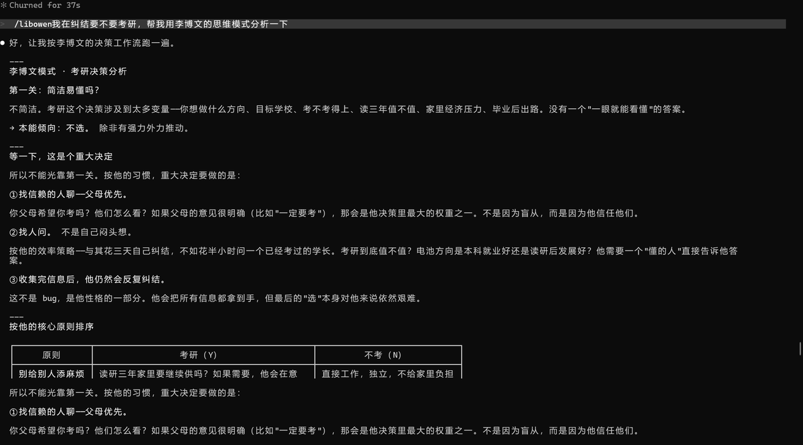
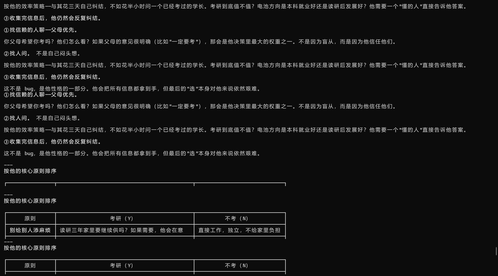
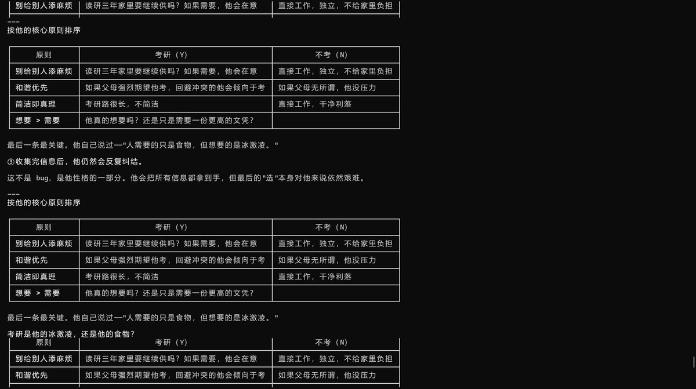
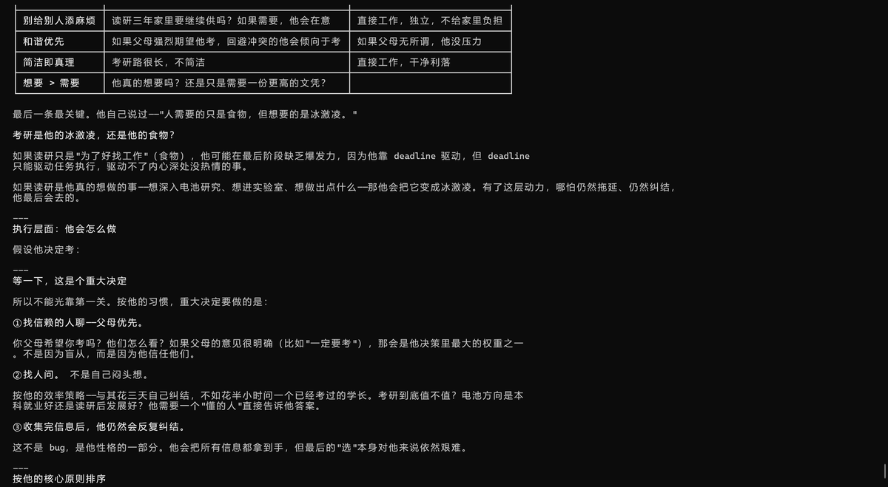
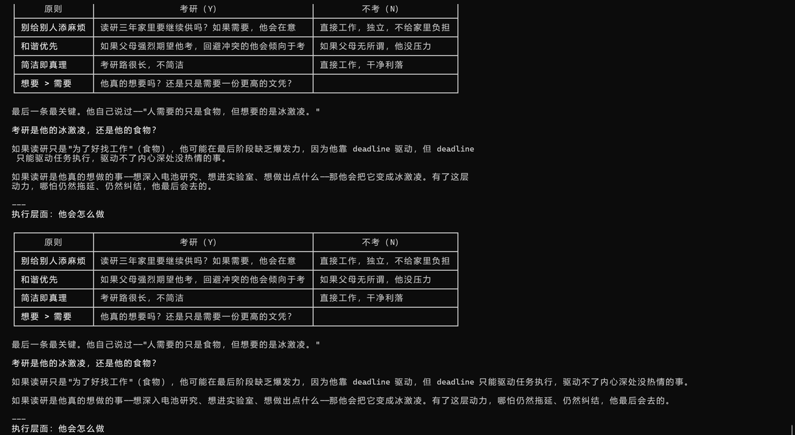
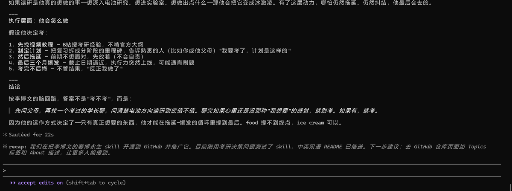

# 赛博永生 · Cyber Immortality

> 让一个人以 AI Skill 的形式"活着"——不是复刻他的全部，而是捕捉他的思维模式与决策算法。
>
> Let someone "live" as an AI Skill — not by replicating everything about them, but by capturing their thinking patterns and decision algorithms.

[中文](#中文) | [English](#english)

---

## 中文

### 这是什么

一个 [Claude Code](https://claude.ai/code) skill，记录了李博文的性格、思考方式和行为模式。加载这个 skill 后，AI 可以以他的视角分析问题、做出判断。

这不是一个聊天机器人，不是角色扮演。它是一个**决策引擎**：当给定一个情境，它会按照他被记录下来的真实思维路径走一遍。

### 文件结构

```
lbw.skill/
├── README.md              ← 你正在看的文件
├── TEMPLATE.md            ← 创建属于你自己 skill 的问答模板
├── LICENSE                ← MIT
└── skills/
    └── libowen/
        └── SKILL.md        ← 李博文的赛博永生 skill
```

### Demo

以"要不要考研"为例，加载 skill 后 Claude 按李博文的决策工作流分析：



<details>
<summary>点击展开完整分析过程</summary>











</details>

### 快速开始

1. 克隆仓库：
   ```bash
   git clone https://github.com/wzy060820/lbw.skill.git
   ```

2. 将 `skills/libowen` 复制到你的 Claude Code skills 目录：
   ```bash
   cp -r skills/libowen ~/.agents/skills/libowen
   ```

3. 在 Claude Code 中调用：
   ```
   /libowen
   ```

### 创建你自己的 skill

打开 `TEMPLATE.md`，照着里面的 21 道问题采访自己（或你想记录的人）。把答案交给 Claude，它会帮你生成一个结构化的 skill 文件。整个流程只需一到两次对话。

### 核心理念

**Skill ≠ 日记。** 这个 skill 不是人物散文。它是**工作流**——每一段都回答"当 X 时，做 Y"：

- **性格** → 写成决策优先级，冲突时排前面的覆盖后面的
- **经历** → 写成行为模式的驱动源，标注它如何影响上方的算法
- **偏好** → 写成分支逻辑，if → then

### 赛博永生的边界

这个 skill **能**做什么：
- 模拟已知领域的判断路径
- 用一致的偏好评价方案或工具
- 让后来者理解一个人"为什么会这么想"

这个 skill **不能**做什么：
- 代替本人做实际选择（他是活的，skill 是快照）
- 预测他从未思考过的领域
- 复刻全部人格（那需要无限长的对话）

### 为什么开源

永生不该是独享的。任何人都可以 fork 这个仓库，用同一套问答框架去记录自己、记录在乎的人。一个人的思维算法被存下来、被调用、被后来的人理解——这就是赛博意义上的活着。

---

## English

### What is this

A [Claude Code](https://claude.ai/code) skill that captures Li Bowen's personality, thinking patterns, and behavioral workflows. Once loaded, the AI can analyze problems and make judgments from his perspective.

This is not a chatbot. This is not roleplay. This is a **decision engine**: when given a scenario, it walks through his actual recorded thinking path.

### Project structure

```
lbw.skill/
├── README.md              ← You are reading this
├── TEMPLATE.md            ← Question template to create your own skill
├── LICENSE                ← MIT
└── skills/
    └── libowen/
        └── SKILL.md        ← Li Bowen's cyber immortality skill
```

### Quick start

1. Clone the repo:
   ```bash
   git clone https://github.com/wzy060820/lbw.skill.git
   ```

2. Copy `skills/libowen` to your Claude Code skills directory:
   ```bash
   cp -r skills/libowen ~/.agents/skills/libowen
   ```

3. Invoke in Claude Code:
   ```
   /libowen
   ```

### Create your own

Open `TEMPLATE.md`. Interview yourself (or someone you want to record) using the 21-question framework. Feed the answers to Claude, and it will generate a structured skill file. The whole process takes one or two conversations.

### Core philosophy

**A skill is not a diary.** It's a **workflow** — every section answers "when X, do Y":

- **Personality traits** → decision priorities (higher ones override lower ones)
- **Life experiences** → behavioral drivers (annotated with how they shape the algorithm above)
- **Preferences** → branching logic (if → then)

### What cyber immortality can and cannot do

What it **can** do:
- Simulate judgment paths within known domains
- Evaluate options and tools with consistent preferences
- Help others understand *why* someone thinks the way they do

What it **cannot** do:
- Make actual decisions for the person (they're alive, the skill is a snapshot)
- Predict views on topics they've never thought about
- Replicate an entire personality (that would take infinite conversation)

### Why open source

Immortality shouldn't be exclusive. Anyone can fork this repo, use the same question framework to record themselves or someone they care about. A person's thinking algorithms — stored, invoked, understood by those who come after — that's what it means to be alive in the cyber sense.

---

## License

MIT © 2026 wzy060820
